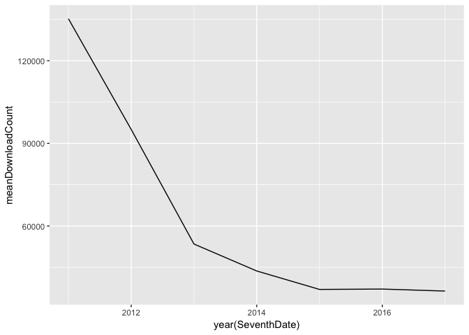
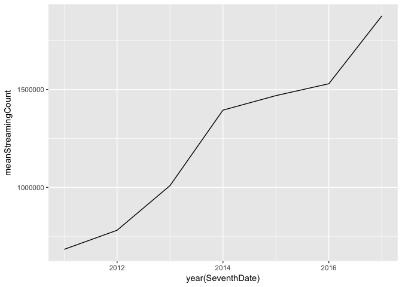
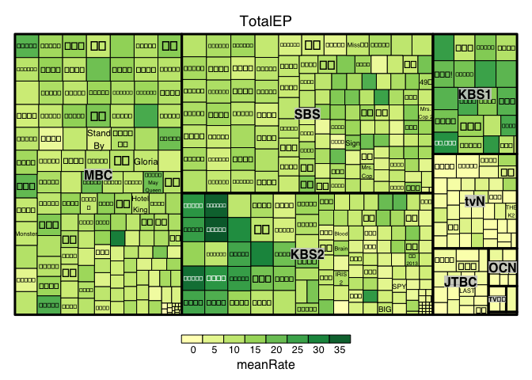
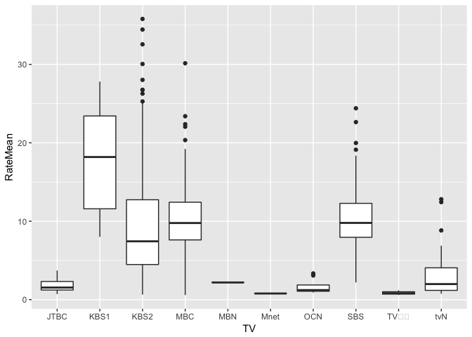
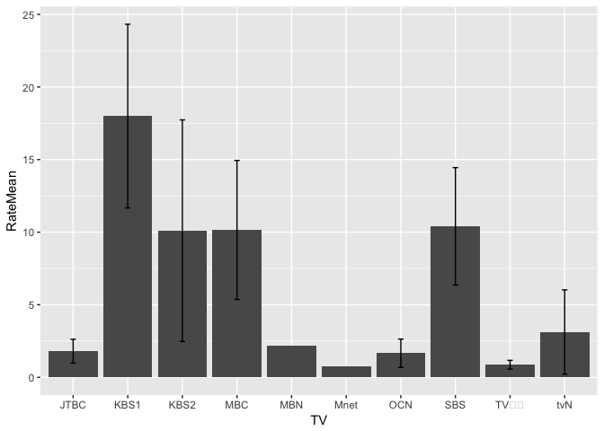

KPOP產業現況與韓劇收視分佈情形，以及韓劇收視率與OST的相關性
================

分析議題背景
------------

台灣的戲劇每週會更新的只有星期一到星期五的八點黨以及假日的偶像劇，相對韓國分得很細，各電視台星期一到五早上8.9點有晨間劇，星期一到五晚上8點有日日劇，星期一二晚上10點有月火劇，星期三四晚上10點有水木劇，星期五六晚上10.11點有金土劇，星期六日晚上9點有週末劇，除了不同劇在不同播出時間有不同名稱外，它們劇的性質以及收視族群也不太一樣，晨間劇、日日劇、週末劇集數通常較長，族群多為中老年人，且平均集數較長，月火劇、水木劇、金土劇則是多為青壯年人，且平均集數較短。 韓國KPOP多為團體，以個人身份出道的較少，且在韓國有三大經紀公司SM、YG、JYP，這三家通常有較多的歌手們，提供的資源與音源成績都較好，再者，因為時代的進步，收聽音樂的習慣也相對應改變，串流比例愈來愈高，而且選秀節目變多，雖有韓團解散，但是新成立的應該愈多，可以想像這一塊產業是更競爭的。 除了韓劇收視率以及音源排名個別分析外，有種歌曲在韓劇裡面唱的叫做OST，又稱原聲帶，電視劇為其的產出方式之一，OST是韓劇與音樂間重要的存在，收視率帶動音源排名、串流、下載的上升，反之也有影響。

分析動機
--------

本人在2013年踏入韓國演藝圈這塊深不可見的沼澤，從初期涉略韓綜到中期韓劇到現在KPOP，韓綜在2014、2015年多以食物相關，近年來愈多生存實境節目，淘汰選拔男團女團人選。韓劇方面，過去收視率高的往往在有線台三台，但是近年來無線台的收視率也有感提昇，就自己觀看的經驗，題材、劇本在無線台比在有線台更沒有限制。而KPOP在最初真的是聽韓劇好聽的OST再去找的，如今認識比較多女團，對這一圈也稍微有些涉略，知道哪些人是在出專輯後就橫掃音源榜的人等等，想找出更多韓劇圈的相關性數據來印證這幾年有經歷過的一切。

使用資料
--------

DownloadChart為韓國Gaon的2011-03-06至2017-05-20每週下載的單曲排名TOP1<sub>100\\ StreamingChart為韓國Gaon的2011-03-06至2017-05-20每週線上串流收聽的單曲排名TOP1</sub>100 DigitalChartWeek為韓國Gaon的2009-12-27至2017-05-20每週各個榜單總和的單曲排名TOP1~100 KoreaDrama為韓劇偶像廣場2010season4至2016season4時期間，韓國有播放的韓劇收視率資料 以上資料都是爬來的，爬完四個資料程式碼約近250行，以檔案載入方式呈現

載入使用資料們

``` r
library(readr)
DownloadChart <- read_delim("~/Documents/GitHub/CGUIM_BigData_HW6-star/DownloadChart.csv", 
    "\t", escape_double = FALSE, trim_ws = TRUE)
StreamingChart <- read_delim("~/Documents/GitHub/CGUIM_BigData_HW6-star/StreamingChart.csv", 
    "\t", escape_double = FALSE, trim_ws = TRUE)
DigitalChartWeek <- read_delim("~/Documents/GitHub/CGUIM_BigData_HW6-star/DigitalChartWeek.csv", 
    "\t", escape_double = FALSE, trim_ws = TRUE)
KoreaDrama <- read_delim("~/KoreaDrama.csv", 
    "\t", escape_double = FALSE, trim_ws = TRUE)
```

資料處理與清洗
--------------

DownLoadChart、StreamingChart、DigitalChart三個表都將DateRange及SingerAlbum欄位內容分開，故原表再加上四個欄位，FirstDate、SeventhDate、Singer、Album，分別是此星期的第一天、此星期的第七天、歌手名稱、專輯名稱。 Step1:將三個表的DateRange欄位分開 Step2:將三個表的SingerAlbum欄位分開 Step3:將分開後產生的四個欄位儲存在一個新的資料框 Step4:新的欄位命名 Step5:合併到原資料框 Step6:將欄位FirstDate及SeventhDate改成日期形式 收視率的資料只想留著兩種，一個是完整的資料，另一個是停播的資料（集數與收視率改為NA，其他欄位都有），以下步驟會朝這兩個目標做以及清理資料，由於收視率資料比較複雜，下面步驟將作詳細說明。 step1:將重複的資料只顯示一筆 step2:由於完整資料與停播資料儲存格皆有值，所以大膽NA沒有關係，在這邊是清理掉不小心抓的平均 step3:有些集數以周次表示成１週、２週，所以將週作為字串分割保留數字 step4:EP欄位排序後觀察出特別篇都有"\*\*"的字眼，在此暫不考慮 step5:Rate欄位有當集有播但沒有資料的，避免與停播資料搞混分析，故移除 step6:Rate欄位只保留數值，且有部分儲存格會註明收視率低的原因：奧運直播等等，兩個一併清理 step7:將EP及Rate欄位轉成數值 step8:新增星期欄位 step9:移除停播的韓劇資料 step10:以星期欄位判定韓劇類型ing

處理資料

``` r
library(data.table)
library(lubridate)
library(dplyr)
library(reshape2)
#音樂榜單的資料清理
FirstDate<-NULL
SeventhDate<-NULL
Singer<-NULL
Album<-NULL
CorrectDownloadChart<-NULL
CorrectStreamingChart<-NULL
CorrectDigitalChart<-NULL
NewDownloadChart<-NULL
NewStreamingChart<-NULL
NewDigitalChart<-NULL
#Step1
DLCSplitDate<-strsplit(DownloadChart$DateRange,"~")
StrSplitDate<-strsplit(StreamingChart$DateRange,"~")
DGTSplitDate<-strsplit(DigitalChartWeek$DateRange,"~")
#Step2
DLCSplitSingerAlbum<-strsplit(DownloadChart$SingerAlbum,'\\|')
StrSplitSingerAlbum<-strsplit(StreamingChart$SingerAlbum,'\\|')
DGTSplitSingerAlbum<-strsplit(DigitalChartWeek$SingerAlbum,'\\|')
#Step3
for(i in 1:dim(DownloadChart)[1]){
  FirstDate<-data.table(DLCSplitDate[[i]][1])
  SeventhDate<-data.table(DLCSplitDate[[i]][2])
  Singer<-data.table(DLCSplitSingerAlbum[[i]][1])
  Album<-data.table(DLCSplitSingerAlbum[[i]][2])
  tempCorrect<-data.table(FirstDate,SeventhDate,Singer,Album)
  CorrectDownloadChart<-rbind(CorrectDownloadChart,tempCorrect)
}
#Step4
dimnames(CorrectDownloadChart)[[2]][1]<-"FirstDate"
dimnames(CorrectDownloadChart)[[2]][2]<-"SeventhDate"
dimnames(CorrectDownloadChart)[[2]][3]<-"Singer"
dimnames(CorrectDownloadChart)[[2]][4]<-"Album"
#Step5
NewDownloadChart<-cbind(DownloadChart,CorrectDownloadChart)
#Step6
NewDownloadChart$FirstDate<-ymd(NewDownloadChart$FirstDate)
NewDownloadChart$SeventhDate<-ymd(NewDownloadChart$SeventhDate)
#Step3
for(i in 1:dim(StreamingChart)[1]){
  FirstDate<-data.table(StrSplitDate[[i]][1])
  SeventhDate<-data.table(StrSplitDate[[i]][2])
  Singer<-data.table(StrSplitSingerAlbum[[i]][1])
  Album<-data.table(StrSplitSingerAlbum[[i]][2])
  tempCorrect<-data.table(FirstDate,SeventhDate,Singer,Album)
  CorrectStreamingChart<-rbind(CorrectStreamingChart,tempCorrect)
}
#Step4
dimnames(CorrectStreamingChart)[[2]][1]<-"FirstDate"
dimnames(CorrectStreamingChart)[[2]][2]<-"SeventhDate"
dimnames(CorrectStreamingChart)[[2]][3]<-"Singer"
dimnames(CorrectStreamingChart)[[2]][4]<-"Album"
#Step5
NewStreamingChart<-cbind(StreamingChart,CorrectStreamingChart)
#Step6
NewStreamingChart$FirstDate<-ymd(NewStreamingChart$FirstDate)
NewStreamingChart$SeventhDate<-ymd(NewStreamingChart$SeventhDate)
#Step3
for(i in 1:dim(DigitalChartWeek)[1]){
  FirstDate<-data.table(DGTSplitDate[[i]][1])
  SeventhDate<-data.table(DGTSplitDate[[i]][2])
  Singer<-data.table(DGTSplitSingerAlbum[[i]][1])
  Album<-data.table(DGTSplitSingerAlbum[[i]][2])
  tempCorrect<-data.table(FirstDate,SeventhDate,Singer,Album)
  CorrectDigitalChart<-rbind(CorrectDigitalChart,tempCorrect)
}
#Step4
dimnames(CorrectDigitalChart)[[2]][1]<-"FirstDate"
dimnames(CorrectDigitalChart)[[2]][2]<-"SeventhDate"
dimnames(CorrectDigitalChart)[[2]][3]<-"Singer"
dimnames(CorrectDigitalChart)[[2]][4]<-"Album"
#Step5
NewDigitalChart<-cbind(DigitalChartWeek,CorrectDigitalChart)
#Step6
NewDigitalChart$FirstDate<-ymd(NewDigitalChart$FirstDate)
NewDigitalChart$SeventhDate<-ymd(NewDigitalChart$SeventhDate)
#write.table(NewDownloadChart,file="NewDownloadChart.csv",sep="\t",row.names = F,col.names = T)
#write.table(NewStreamingChart,file="NewStreamingChart.csv",sep="\t",row.names = F,col.names = T)
#write.table(NewDigitalChart,file="NewDigitalChart.csv",sep="\t",row.names = F,col.names = T)

#韓劇收視率的資料清理
#Step1
NewKoreaDrama<-unique(KoreaDrama)
#Step2
NewKoreaDrama<-NewKoreaDrama[complete.cases(NewKoreaDrama),]
#Step3
NewKoreaDrama$EP<-strsplit(NewKoreaDrama$EP,"週")
#Step4
NewKoreaDrama<-NewKoreaDrama[!grepl("\\*\\*",NewKoreaDrama$EP),]
#Step5
NewKoreaDrama<-NewKoreaDrama[!grepl("\\*\\.\\*",NewKoreaDrama$Rate),]
#Step6
splitRate<-strsplit(NewKoreaDrama$Rate,'\\%')
for(i in 1:dim(NewKoreaDrama)[1]){
  NewKoreaDrama[i,6]<-splitRate[[i]][1]
}
#Step7
NewKoreaDrama$EP<-as.numeric(NewKoreaDrama$EP)
NewKoreaDrama$Rate<-as.numeric(NewKoreaDrama$Rate)
#Step8
NewKoreaDrama<-cbind(NewKoreaDrama,data.table(weekdays(NewKoreaDrama$Date)))
dimnames(NewKoreaDrama)[[2]][7]<-"Weekday"
#Step9
NonNARateKoreaDrama<-NewKoreaDrama[complete.cases(NewKoreaDrama),]
#step10
Monday<-filter(NewKoreaDrama,Weekday=="週一") %>%
  group_by(ChineseDramaName,KoreaDramaName,TV,Weekday) %>%
    summarise(nMonday=n())
Tuesday<-filter(NewKoreaDrama,Weekday=="週二") %>%
  group_by(ChineseDramaName,KoreaDramaName,TV,Weekday) %>%
    summarise(nTuesday=n())
Wednesday<-filter(NewKoreaDrama,Weekday=="週三") %>%
  group_by(ChineseDramaName,KoreaDramaName,TV,Weekday) %>%
    summarise(nWednesday=n())
Thursday<-filter(NewKoreaDrama,Weekday=="週四") %>%
  group_by(ChineseDramaName,KoreaDramaName,TV,Weekday) %>%
    summarise(nThursday=n())
Friday<-filter(NewKoreaDrama,Weekday=="週五") %>%
  group_by(ChineseDramaName,KoreaDramaName,TV,Weekday) %>%
    summarise(nFriday=n())
Saturday<-filter(NewKoreaDrama,Weekday=="週六") %>%
  group_by(ChineseDramaName,KoreaDramaName,TV,Weekday) %>%
    summarise(nSaturday=n())
Sunday<-filter(NewKoreaDrama,Weekday=="週日") %>%
  group_by(ChineseDramaName,KoreaDramaName,TV,Weekday) %>%
    summarise(nSunday=n())

#write.table(NewKoreaDrama,file="NewKoreaDrama.csv",sep="\t",row.names = F,col.names = T)
```

探索式資料分析
--------------

``` r
library(ggplot2)
library(treemap)
library(plotly)


#每年音源前100的下載數平均
MeanYearDownloadCount<-group_by(NewDownloadChart,year(SeventhDate)) %>%
    summarise(meanDownloadCount=mean(DownloadCount))
#每年音源前100名平均下載數折線圖
ggplot(MeanYearDownloadCount,aes(x = `year(SeventhDate)`,y = meanDownloadCount)) + 
    geom_line()
```



``` r
#每年音源前100的串流數平均
MeanYearStreamingCount<-group_by(NewStreamingChart,year(SeventhDate)) %>%
    summarise(meanStreamingCount=mean(StreamingCount))
#每年音源前100名平均串流數折線圖
ggplot(MeanYearStreamingCount,aes(x = `year(SeventhDate)`,y = meanStreamingCount)) + 
    geom_line()
```



``` r
#每部韓劇平均收視率
MeanRateByDrama<-group_by(NonNARateKoreaDrama,ChineseDramaName,KoreaDramaName,TV) %>%
    summarise(meanRate=mean(Rate),TotalEP=n())
#以電視台區分各韓劇，大小為集數深淺為收視率，目前還沒解決圖形上顯示中文的問題
treemap(MeanRateByDrama,
       index=c("TV", "ChineseDramaName"),
       vSize="TotalEP", 
       vColor="meanRate", 
       type="value",
       fontsize.labels=c(12))
```



``` r
#每個電視台每部韓劇平均收視率盒狀圖
MeanRateByDrama.box<-MeanRateByDrama%>%group_by(ChineseDramaName,KoreaDramaName,TV)%>%
    summarise(RateMean=mean(meanRate,na.rm = T))
ggplot(data=MeanRateByDrama.box)+ 
    geom_boxplot(aes(x=TV,y=RateMean))
```



``` r
#每個電視台每部韓劇平均收視率長條圖與誤差
MeanRateByDrama$TV<-as.factor(MeanRateByDrama$TV)
MeanRateByDrama.mean<-MeanRateByDrama%>%group_by(TV)%>%
    summarise(RateMean=mean(meanRate,na.rm = T),RateSD=sd(meanRate,na.rm = T))
ggplot(data=MeanRateByDrama.mean)+ 
    geom_bar(aes(x=TV,y=RateMean),
             stat = "identity")+
    geom_errorbar(aes(x=TV,ymin=RateMean-RateSD,
            ymax=RateMean+RateSD), width=.1)
```



期末專題分析規劃
----------------

期末報告前會以韓劇播出時間來分韓劇類型，水木劇、月火劇等等，然後再將音源篩選出有OST的，因為OST前面的韓文字就是劇名，因此可以看出兩個的相關性，比如哪些類型的劇OST數量在音源排名最多、名列前茅、在音源榜單待最久等等。 目前想到的假設： 1.看各年份音源排名下降速率，推估KPOP產業變競爭 2.串流數量逐年上升，下載數量逐年下降，看出聽音樂習慣的改變 3.水木劇、月火劇、金土劇收視率較高的劇，OST在音源榜單上維持較久
