KPOP產業現況與韓劇收視分佈情形，以及韓劇收視率與OST的相關性
================

大綱
----

1.分析議題背景 2.分析動機 3.使用資料 4.爬取Gaon的DownloadChart 5.爬取韓劇偶像廣場的KoreaDrama資料的程式碼 6.處理資料 7.假設 8.資料分析與作圖 9.結論

分析議題背景
------------

韓國KPOP多為團體，以個人身份出道的較少，且在韓國有三大經紀公司SM、YG、JYP，這三家通常有較多的歌手們，提供的資源與音源成績都較好，再者，因為時代的進步，收聽音樂的習慣也相對應改變，串流比例愈來愈高，而且選秀節目變多，雖有韓團解散，但是新成立的應該愈多，可以想像這一塊產業是更競爭的。 台灣的戲劇每週會更新的只有星期一到星期五的八點檔以及假日的偶像劇，相對韓國分得很細，各電視台星期一到五晚上8點有日日劇，星期一二晚上10點有月火劇，星期三四晚上10點有水木劇，星期五六晚上10點有金土劇，星期六日晚上8點有週末劇，除了不同劇在不同播出時間有不同名稱外，它們劇的性質以及收視族群也不太一樣，日日劇、週末劇集數通常較長，族群多為中老年人，且平均集數較長，月火劇、水木劇、金土劇則是多為青壯年人，且平均集數較短。 除了韓劇收視率以及音源排名個別分析外，有種歌曲在韓劇裡面唱的叫做OST，又稱原聲帶，電視劇為其的產出方式之一，OST是韓劇與音樂間重要的存在，收視率帶動音源排名、串流、下載的上升，反之也有影響。 韓劇第八集定律是過往韓劇都會在第八集有第一次的吻戲，但現今吻戲集數有向前發生的趨勢。

``` r
#以播出時間分類韓劇類型
type<-data.frame(c("","晚上8點","晚上10點"),c("星期一","日日劇","月火劇"),c("星期二","日日劇","月火劇"),c("星期三","日日劇","水木劇"),c("星期四","日日劇","水木劇"),c("星期五","日日劇","金土劇"),c("星期六","週末劇","金土劇"),c("星期日","週末劇",""))
knitr::kable(type)
```

| c......晚上8點....晚上10點.. | c..星期一....日日劇....月火劇.. | c..星期二....日日劇....月火劇.. | c..星期三....日日劇....水木劇.. | c..星期四....日日劇....水木劇.. | c..星期五....日日劇....金土劇.. | c..星期六....週末劇....金土劇.. | c..星期日....週末劇...... |
|:-----------------------------|:--------------------------------|:--------------------------------|:--------------------------------|:--------------------------------|:--------------------------------|:--------------------------------|:--------------------------|
|                              | 星期一                          | 星期二                          | 星期三                          | 星期四                          | 星期五                          | 星期六                          | 星期日                    |
| 晚上8點                      | 日日劇                          | 日日劇                          | 日日劇                          | 日日劇                          | 日日劇                          | 週末劇                          | 週末劇                    |
| 晚上10點                     | 月火劇                          | 月火劇                          | 水木劇                          | 水木劇                          | 金土劇                          | 金土劇                          |                           |

分析動機
--------

本人在2013年踏入韓國演藝圈這塊深不可見的沼澤，從初期涉略韓綜到中期韓劇到現在KPOP，韓綜在2014、2015年多以食物相關，近年來愈多生存實境節目，淘汰選拔男團女團人選。韓劇方面，過去收視率高的往往在有線台三台，但是近年來無線台的收視率也有感提昇，就自己觀看的經驗，題材、劇本在無線台比在有線台更沒有限制。而KPOP在最初真的是聽韓劇好聽的OST再去找的，如今認識比較多女團，對這一圈也稍微有些涉略，知道哪些人是在出專輯後就橫掃音源榜的人等等，想找出更多韓劇圈的相關性數據來印證這幾年有經歷過的一切XDD。

使用資料
--------

[Gaon](http://gaonchart.co.kr/main/section/chart/online.gaon?nationGbn=T&serviceGbn=ALL) [韓國偶像劇場](http://kr.dorama.info/drama/d_rate.php) DownloadChart為韓國Gaon的2011-03-06至2017-05-20每週下載的單曲排名TOP1<sub>100\\ StreamingChart為韓國Gaon的2011-03-06至2017-05-20每週線上串流收聽的單曲排名TOP1</sub>100 DigitalChartWeek為韓國Gaon的2009-12-27至2017-05-20每週各個榜單總和的單曲排名TOP1~100 KoreaDrama為韓劇偶像廣場2010season4至2016season4時期間，韓國有播放的韓劇收視率資料 以下兩個Chunk為爬取以上四個資料的程式碼

爬取Gaon的DownloadChart、StreamingChart、DigitalChartWeek資料的程式碼

``` r
library(rvest)
library(stringr)
library(data.table)
#Sys.setlocale(category = "LC_ALL", locale = "kor")
#Sys.setlocale(category = "LC_ALL", locale = "cht")
DLCData<-NULL
#Gaon下載數量表的爬取分別有DateRange、Ranking、Song、SingerAlbum、DownloadCount、ManagementCompany、RecordCompany七個欄位
GaonDownloadChart<-"http://gaonchart.co.kr/main/section/chart/online.gaon?nationGbn=T&serviceGbn=S1020&targetTime=20&hitYear=2017&termGbn=week"
DLCContent<-read_html(GaonDownloadChart)
DLCDateRange <- str_trim(DLCContent %>% html_nodes("option") %>% html_text())
DLCDateWeek<- substr(DLCContent %>% html_nodes("option") %>% html_attr("value"),start=5,stop=6)
DLCDateYear<- substr(DLCContent %>% html_nodes("option") %>% html_attr("value"),start=1,stop=4)
for(i in 325:2){
  GaonDownloadChart<-paste0("http://gaonchart.co.kr/main/section/chart/online.gaon?nationGbn=T&serviceGbn=S1020&targetTime=",DLCDateWeek[i],"&hitYear=",DLCDateYear[i],"&termGbn=week")
  DLCContent<-read_html(GaonDownloadChart)
  DLCRank <- str_trim(DLCContent %>% html_nodes("td") %>% html_text())
  DLCOther <- str_trim(DLCContent %>% html_nodes("p") %>% html_text())
  for(j in 0:99){
    tempDLCDateRange<-data.table(DLCDateRange[i])
    tempDLCRank<-data.table(DLCRank[1+8*j])
    tempDLCSong<-data.table(DLCOther[1+5*j])
    tempDLCSingerAlbum<-data.table(DLCOther[2+5*j])
    tempDLCDLCount<-data.table(DLCOther[3+5*j])
    tempDLCMC<-data.table(DLCOther[4+5*j])
    tempDLCRC<-data.table(DLCOther[5+5*j])
    tempData<-c(tempDLCDateRange,tempDLCRank,tempDLCSong,tempDLCSingerAlbum,tempDLCDLCount,tempDLCMC,tempDLCRC)
    DLCData<-rbind(DLCData,tempData)
  }
  i=i-1
}

dimnames(DLCData)[[2]][1]<-"DateRange"
dimnames(DLCData)[[2]][2]<-"Ranking"
dimnames(DLCData)[[2]][3]<-"Song"
dimnames(DLCData)[[2]][4]<-"SingerAlbum"
dimnames(DLCData)[[2]][5]<-"DownloadCount"
dimnames(DLCData)[[2]][6]<-"ManagementCompany"
dimnames(DLCData)[[2]][7]<-"RecordCompany"
write.table(DLCData,file="DownloadChart.csv",sep="\t",row.names = F,col.names = T)
#Gaon串流數量表的爬取分別有DateRange、Ranking、Song、SingerAlbum、StreamingCount、ManagementCompany、RecordCompany七個欄位
StrData<-NULL
GaonStreamingChart<-"http://gaonchart.co.kr/main/section/chart/online.gaon?nationGbn=T&serviceGbn=S1040&targetTime=20&hitYear=2017&termGbn=week"
StrContent<-read_html(GaonStreamingChart)
StrDateRange <- str_trim(StrContent %>% html_nodes("option") %>% html_text())
StrDateWeek<- substr(StrContent %>% html_nodes("option") %>% html_attr("value"),start=5,stop=6)
StrDateYear<- substr(StrContent %>% html_nodes("option") %>% html_attr("value"),start=1,stop=4)

for(i in 325:2){
  GaonStreamingChart<-paste0("http://gaonchart.co.kr/main/section/chart/online.gaon?nationGbn=T&serviceGbn=S1040&targetTime=",StrDateWeek[i],"&hitYear=",StrDateYear[i],"&termGbn=week")
  StrContent<-read_html(GaonStreamingChart)
  StrRank <- str_trim(StrContent %>% html_nodes("td") %>% html_text())
  StrOther <- str_trim(StrContent %>% html_nodes("p") %>% html_text())
  for(j in 0:99){
    tempStrDateRange<-data.table(StrDateRange[i])
    tempStrRank<-data.table(StrRank[1+8*j])
    tempStrSong<-data.table(StrOther[1+5*j])
    tempStrSingerAlbum<-data.table(StrOther[2+5*j])
    tempStrStrCount<-data.table(StrOther[3+5*j])
    tempStrMC<-data.table(StrOther[4+5*j])
    tempStrRC<-data.table(StrOther[5+5*j])
    tempData<-c(tempStrDateRange,tempStrRank,tempStrSong,tempStrSingerAlbum,tempStrStrCount,tempStrMC,tempStrRC)
    StrData<-rbind(StrData,tempData)
  }
  i=i-1
}

dimnames(StrData)[[2]][1]<-"DateRange"
dimnames(StrData)[[2]][2]<-"Ranking"
dimnames(StrData)[[2]][3]<-"Song"
dimnames(StrData)[[2]][4]<-"SingerAlbum"
dimnames(StrData)[[2]][5]<-"StreamingCount"
dimnames(StrData)[[2]][6]<-"ManagementCompany"
dimnames(StrData)[[2]][7]<-"RecordCompany"
write.table(StrData,file="StreamingChart.csv",sep="\t",row.names = F,col.names = T)

#Gaon串流數量表的爬取分別有DateRange、Ranking、Song、SingerAlbum、ManagementCompany、RecordCompany六個欄位
DGTData<-NULL
GaonDigitalChart<-"http://gaonchart.co.kr/main/section/chart/online.gaon?nationGbn=T&serviceGbn=ALL&targetTime=20&hitYear=2017&termGbn=week"
DGTContent<-read_html(GaonDigitalChart)
DGTDateRange <- str_trim(DGTContent %>% html_nodes("option") %>% html_text())
DGTDateWeek<- substr(DGTContent %>% html_nodes("option") %>% html_attr("value"),start=5,stop=6)
DGTDateYear<- substr(DGTContent %>% html_nodes("option") %>% html_attr("value"),start=1,stop=4)
for(i in 387:2){
  GaonDigitalChart<-paste0("http://gaonchart.co.kr/main/section/chart/online.gaon?nationGbn=T&serviceGbn=ALL&targetTime=",DGTDateWeek[i],"&hitYear=",DGTDateYear[i],"&termGbn=week")
  DGTContent<-read_html(GaonDigitalChart)
  DGTRank <- str_trim(DGTContent %>% html_nodes("td") %>% html_text())
  DGTOther <- str_trim(DGTContent %>% html_nodes("p") %>% html_text())
  for(j in 0:99){
    tempDGTDateRange<-data.table(DGTDateRange[i])
    tempDGTRank<-data.table(DGTRank[1+7*j])
    tempDGTSong<-data.table(DGTOther[1+4*j])
    tempDGTSingerAlbum<-data.table(DGTOther[2+4*j])
    tempDGTMC<-data.table(DGTOther[3+4*j])
    tempDGTRC<-data.table(DGTOther[4+4*j])
    tempData<-c(tempDGTDateRange,tempDGTRank,tempDGTSong,tempDGTSingerAlbum,tempDGTMC,tempDGTRC)
    DGTData<-rbind(DGTData,tempData)
  }
  i=i-1
}

dimnames(DGTData)[[2]][1]<-"DateRange"
dimnames(DGTData)[[2]][2]<-"Ranking"
dimnames(DGTData)[[2]][3]<-"Song"
dimnames(DGTData)[[2]][4]<-"SingerAlbum"
dimnames(DGTData)[[2]][5]<-"ManagementCompany"
dimnames(DGTData)[[2]][6]<-"RecordCompany"
write.table(DGTData,file="DiritalChartWeek.csv",sep="\t",row.names = F,col.names = T)
```

爬取韓劇偶像廣場的KoreaDrama資料的程式碼

``` r
#此韓劇收視率網站比較不制式化，有較詳細說明
library(rvest)
library(stringr)
library(data.table)
#Sys.setlocale(category = "LC_ALL", locale = "kor")
#Sys.setlocale(category = "LC_ALL", locale = "cht")
DramaURL<-NULL
KoreaData<-NULL
# 第一個頁面是韓劇每季播出項目的收視率總表，由於表格上的收視率難以歸類爬取，在此第一個頁面只抓取每部韓劇詳細網站超連結網址，並且整理跨季播出的連結只輸出一項，此頁面不做任何欄位輸出。
FirstPage<-"http://kr.dorama.info/drama/d_rate.php?year=2016&season=4&ord=7&gk=1&nt=4&aa=4&rt=0"
while(FirstPage!="http://kr.dorama.info/drama/d_rate.php?year=2010&season=4&ord=7&gk=1&nt=4&aa=4&rt=0"){
  FirstContent<-read_html(FirstPage)
  EachURL<-FirstContent %>% html_nodes("a") %>% html_attr("href")
  SelectedURL<- grep(".html",FirstContent %>% html_nodes("a") %>% html_attr("href"))
  for(i in SelectedURL){
    DramaURL<-c(DramaURL,EachURL[i])
  }  
  NextSeason<-grep("上一季",str_trim(FirstContent %>% html_nodes("a") %>% html_text()))
  FirstPage<-paste0("http://kr.dorama.info/drama/",(FirstContent %>% html_nodes("a") %>% html_attr("href"))[NextSeason])
}
DramaURL<-unique(DramaURL)
#第二個頁面儲存KoreaDramaName、ChineseDramaName欄位值，並存取收視率網址頁面
  for(j in 1:length(DramaURL)){
    SecondPage<-paste0("http://kr.dorama.info",DramaURL[j])
    SecondContent<-read_html(SecondPage)
    KoreaDramaName<-(str_trim(SecondContent %>% html_nodes("td.td2_g") %>% html_text()))[5]
    ChineseDramaName<-(str_trim(SecondContent %>% html_nodes("font.sz5.fcol_drama") %>% html_text()))[1]
    DramaCode<-(strsplit(DramaURL[j],"/drama-|.html"))[[1]][2]
#第三個頁面主要為輸出欄位與擷取收視率，但收視率最後一集集數或格式不同所以有些終止條件設置，以下會說明
    ThirdPage<-paste0("http://kr.dorama.info/drama/pfd_rate.php?num=",DramaCode)
    ThirdContent<-read_html(ThirdPage)
    TV<-(strsplit(ThirdContent %>% html_nodes("td.th2_g") %>% html_text()," "))[[1]][8]
    MainData<-str_trim(ThirdContent %>% html_nodes("td.td_dt_g") %>% html_text())

#先判斷收視率頁面有沒有大於一頁，原因有二：一個是會因為有大於一頁會有上一頁下一頁的字樣，導致抓取的列不對，另一個判斷是否進入下一頁抓取
    if(grepl("下一頁|上一頁",MainData[3])){
      for(m in (strsplit(MainData[3]," "))[[1]][1]:(length(strsplit(MainData[3]," "))-2)){
        k<-8
        ThirdPage<-paste0("http://kr.dorama.info/drama/pfd_rate.php?page=",m,"&num=",DramaCode)
        ThirdContent<-read_html(ThirdPage)
        MainData<-str_trim(ThirdContent %>% html_nodes("td.td_dt_g") %>% html_text())
#第一種終止條件為最後一集是完結篇字樣，另一個終止條件是顯示最後一集的集數
        if(is.na(grep("完結篇",MainData)[1])){
          for(n in k:length(MainData)){
            if(n%%4==0){
              tempEP<-data.table(MainData[n-3])
              tempDate<-data.table(MainData[n-2])
              tempRate<-data.table(MainData[n-1])
              tempData<-c(ChineseDramaName,KoreaDramaName,TV,tempEP,tempDate,tempRate)
              KoreaData<-rbind(KoreaData,tempData)
              k<-k+4
            }
            
          }
        }
        else
        {
          while(MainData[k-3]!="完結篇"){
            tempEP<-data.table(MainData[k-3])
            tempDate<-data.table(MainData[k-2])
            tempRate<-data.table(MainData[k-1])
            if(!(grepl("上一頁",tempDate))){
              tempData<-c(ChineseDramaName,KoreaDramaName,TV,tempEP,tempDate,tempRate)
              KoreaData<-rbind(KoreaData,tempData)
            }
            else{
              next
            }
            k<-k+4
          }
          tempEP<-as.numeric(MainData[k-7])+1
          tempDate<-data.table(MainData[k-2])
          tempRate<-data.table(MainData[k-1])
          tempData<-c(ChineseDramaName,KoreaDramaName,TV,tempEP,tempDate,tempRate)
          KoreaData<-rbind(KoreaData,tempData)
          
        }
        
      }
    }
    else{
      k<-5
      if(is.na(grep("完結篇",MainData)[1])){
        for(n in k:length(MainData)){
          if((n-1)%%4==0){
            tempEP<-data.table(MainData[n-3])
            tempDate<-data.table(MainData[n-2])
            tempRate<-data.table(MainData[n-1])
            tempData<-c(ChineseDramaName,KoreaDramaName,TV,tempEP,tempDate,tempRate)
            KoreaData<-rbind(KoreaData,tempData)
            k<-k+4
          }
        }
      }
      else
      {
        while(MainData[k-3]!="完結篇"){
          tempEP<-data.table(MainData[k-3])
          tempDate<-data.table(MainData[k-2])
          tempRate<-data.table(MainData[k-1])
          if(!(grepl("上一頁",tempDate))){
            tempData<-c(ChineseDramaName,KoreaDramaName,TV,tempEP,tempDate,tempRate)
            KoreaData<-rbind(KoreaData,tempData)
          }
          else{
            next
          }
          k<-k+4
        }
        tempEP<-as.numeric(MainData[k-7])+1
        tempDate<-data.table(MainData[k-2])
        tempRate<-data.table(MainData[k-1])
        tempData<-c(ChineseDramaName,KoreaDramaName,TV,tempEP,tempDate,tempRate)
        KoreaData<-rbind(KoreaData,tempData)
      }
    }
  }
dimnames(KoreaData)[[2]][1]<-"ChineseDramaName"
dimnames(KoreaData)[[2]][2]<-"KoreaDramaName"
dimnames(KoreaData)[[2]][3]<-"TV"
dimnames(KoreaData)[[2]][4]<-"EP"
dimnames(KoreaData)[[2]][5]<-"Date"
dimnames(KoreaData)[[2]][6]<-"Rate"
write.table(KoreaData,file="KoreaDrama.csv",sep="\t",row.names = F,col.names = T)
```

載入使用資料，避免每次爬取所以先存一次檔案

``` r
library(readr)
DownloadChart <- read_delim("~/Documents/GitHub/CGUIM_BigData_HW6-star/DownloadChart.csv", 
    "\t", escape_double = FALSE, trim_ws = TRUE)
StreamingChart <- read_delim("~/Documents/GitHub/CGUIM_BigData_HW6-star/StreamingChart.csv", 
    "\t", escape_double = FALSE, trim_ws = TRUE)
DigitalChartWeek <- read_delim("~/Documents/GitHub/CGUIM_BigData_HW6-star/DigitalChartWeek.csv", 
    "\t", escape_double = FALSE, trim_ws = TRUE)
KoreaDrama <- read_delim("~/Documents/GitHub/CGUIM_BigData_HW6-star/KoreaDrama.csv", 
    "\t", escape_double = FALSE, trim_ws = TRUE)
```

資料處理與清洗
--------------

DownLoadChart、StreamingChart、DigitalChart三個表都將DateRange及SingerAlbum欄位內容分開，故原表再加上四個欄位，FirstDate、SeventhDate、Singer、Album，分別是此星期的第一天、此星期的第七天、歌手名稱、專輯名稱。 Step1:將三個表的DateRange欄位分開 Step2:將三個表的SingerAlbum欄位分開 Step3:將分開後產生的四個欄位儲存在一個新的資料框 Step4:新的欄位命名 Step5:合併到原資料框 Step6:將欄位FirstDate及SeventhDate改成日期形式，並補充下方作圖常常遺失的儲存格值 收視率的資料只想留著兩種，一個是完整的資料，另一個是停播的資料（集數與收視率改為NA，其他欄位都有），以下步驟會朝這兩個目標做以及清理資料，由於收視率資料比較複雜，下面步驟將作詳細說明。 step1:將重複的資料只顯示一筆 step2:由於完整資料與停播資料儲存格皆有值，所以大膽NA沒有關係，在這邊是清理掉不小心抓的平均 step3:有些集數以周次表示成１週、２週，所以將週作為字串分割保留數字 step4:EP欄位排序後觀察出特別篇都有"\*\*"的字眼，在此暫不考慮 step5:Rate欄位有當集有播但沒有資料的，避免與停播資料搞混分析，故移除 step6:Rate欄位只保留數值，且有部分儲存格會註明收視率低的原因：奧運直播等等，兩個一併清理 step7:將EP及Rate欄位轉成數值 step8:新增星期欄位 step9:移除停播的韓劇資料 step10:以星期欄位判定韓劇類型ing

處理資料

``` r
library(data.table)
library(lubridate)
library(dplyr)
library(reshape2)
#音樂榜單的資料清理
FirstDate<-NULL
SeventhDate<-NULL
Singer<-NULL
Album<-NULL
CorrectDownloadChart<-NULL
CorrectStreamingChart<-NULL
CorrectDigitalChart<-NULL
NewDownloadChart<-NULL
NewStreamingChart<-NULL
NewDigitalChart<-NULL
#Step1
DLCSplitDate<-strsplit(DownloadChart$DateRange,"~")
StrSplitDate<-strsplit(StreamingChart$DateRange,"~")
DGTSplitDate<-strsplit(DigitalChartWeek$DateRange,"~")
#Step2
DLCSplitSingerAlbum<-strsplit(DownloadChart$SingerAlbum,'\\|')
StrSplitSingerAlbum<-strsplit(StreamingChart$SingerAlbum,'\\|')
DGTSplitSingerAlbum<-strsplit(DigitalChartWeek$SingerAlbum,'\\|')
#Step3
for(i in 1:dim(DownloadChart)[1]){
  FirstDate<-data.table(DLCSplitDate[[i]][1])
  SeventhDate<-data.table(DLCSplitDate[[i]][2])
  Singer<-data.table(DLCSplitSingerAlbum[[i]][1])
  Album<-data.table(DLCSplitSingerAlbum[[i]][2])
  tempCorrect<-data.table(FirstDate,SeventhDate,Singer,Album)
  CorrectDownloadChart<-rbind(CorrectDownloadChart,tempCorrect)
}
#Step4
dimnames(CorrectDownloadChart)[[2]][1]<-"FirstDate"
dimnames(CorrectDownloadChart)[[2]][2]<-"SeventhDate"
dimnames(CorrectDownloadChart)[[2]][3]<-"Singer"
dimnames(CorrectDownloadChart)[[2]][4]<-"Album"
#Step5
NewDownloadChart<-cbind(DownloadChart,CorrectDownloadChart)
#Step6
NewDownloadChart$FirstDate<-ymd(NewDownloadChart$FirstDate)
NewDownloadChart$SeventhDate<-ymd(NewDownloadChart$SeventhDate)
#Step3
for(i in 1:dim(StreamingChart)[1]){
  FirstDate<-data.table(StrSplitDate[[i]][1])
  SeventhDate<-data.table(StrSplitDate[[i]][2])
  Singer<-data.table(StrSplitSingerAlbum[[i]][1])
  Album<-data.table(StrSplitSingerAlbum[[i]][2])
  tempCorrect<-data.table(FirstDate,SeventhDate,Singer,Album)
  CorrectStreamingChart<-rbind(CorrectStreamingChart,tempCorrect)
}
#Step4
dimnames(CorrectStreamingChart)[[2]][1]<-"FirstDate"
dimnames(CorrectStreamingChart)[[2]][2]<-"SeventhDate"
dimnames(CorrectStreamingChart)[[2]][3]<-"Singer"
dimnames(CorrectStreamingChart)[[2]][4]<-"Album"
#Step5
NewStreamingChart<-cbind(StreamingChart,CorrectStreamingChart)
#Step6
NewStreamingChart$FirstDate<-ymd(NewStreamingChart$FirstDate)
NewStreamingChart$SeventhDate<-ymd(NewStreamingChart$SeventhDate)
#Step3
for(i in 1:dim(DigitalChartWeek)[1]){
  FirstDate<-data.table(DGTSplitDate[[i]][1])
  SeventhDate<-data.table(DGTSplitDate[[i]][2])
  Singer<-data.table(DGTSplitSingerAlbum[[i]][1])
  Album<-data.table(DGTSplitSingerAlbum[[i]][2])
  tempCorrect<-data.table(FirstDate,SeventhDate,Singer,Album)
  CorrectDigitalChart<-rbind(CorrectDigitalChart,tempCorrect)
}
#Step4
dimnames(CorrectDigitalChart)[[2]][1]<-"FirstDate"
dimnames(CorrectDigitalChart)[[2]][2]<-"SeventhDate"
dimnames(CorrectDigitalChart)[[2]][3]<-"Singer"
dimnames(CorrectDigitalChart)[[2]][4]<-"Album"
#Step5
NewDigitalChart<-cbind(DigitalChartWeek,CorrectDigitalChart)
#Step6
NewDigitalChart$FirstDate<-ymd(NewDigitalChart$FirstDate)
NewDigitalChart$SeventhDate<-ymd(NewDigitalChart$SeventhDate)
NewStreamingChart[3920,5]<-900000
write.table(NewDownloadChart,file="NewDownloadChart.csv",sep="\t",row.names = F,col.names = T)
write.table(NewStreamingChart,file="NewStreamingChart.csv",sep="\t",row.names = F,col.names = T)
write.table(NewDigitalChart,file="NewDigitalChart.csv",sep="\t",row.names = F,col.names = T)

#韓劇收視率的資料清理
#Step1
NewKoreaDrama<-unique(KoreaDrama)
#Step2
NewKoreaDrama<-NewKoreaDrama[complete.cases(NewKoreaDrama),]
#Step3
NewKoreaDrama$EP<-strsplit(NewKoreaDrama$EP,"週")
#Step4
NewKoreaDrama<-NewKoreaDrama[!grepl("\\*\\*",NewKoreaDrama$EP),]
#Step5
NewKoreaDrama<-NewKoreaDrama[!grepl("\\*\\.\\*",NewKoreaDrama$Rate),]
#Step6
splitRate<-strsplit(NewKoreaDrama$Rate,'\\%')
for(i in 1:dim(NewKoreaDrama)[1]){
  NewKoreaDrama[i,6]<-splitRate[[i]][1]
}
#Step7
NewKoreaDrama$EP<-as.numeric(NewKoreaDrama$EP)
NewKoreaDrama$Rate<-as.numeric(NewKoreaDrama$Rate)
#Step8
NewKoreaDrama<-cbind(NewKoreaDrama,data.table(weekdays(NewKoreaDrama$Date)))
dimnames(NewKoreaDrama)[[2]][7]<-"Weekday"
#Step9
NonNARateKoreaDrama<-NewKoreaDrama[complete.cases(NewKoreaDrama),]
#step10
Monday<-filter(NewKoreaDrama,Weekday=="週一") %>%
  group_by(ChineseDramaName,KoreaDramaName,TV,Weekday) %>%
    summarise(nMonday=n())
Tuesday<-filter(NewKoreaDrama,Weekday=="週二") %>%
  group_by(ChineseDramaName,KoreaDramaName,TV,Weekday) %>%
    summarise(nTuesday=n())
Wednesday<-filter(NewKoreaDrama,Weekday=="週三") %>%
  group_by(ChineseDramaName,KoreaDramaName,TV,Weekday) %>%
    summarise(nWednesday=n())
Thursday<-filter(NewKoreaDrama,Weekday=="週四") %>%
  group_by(ChineseDramaName,KoreaDramaName,TV,Weekday) %>%
    summarise(nThursday=n())
Friday<-filter(NewKoreaDrama,Weekday=="週五") %>%
  group_by(ChineseDramaName,KoreaDramaName,TV,Weekday) %>%
    summarise(nFriday=n())
Saturday<-filter(NewKoreaDrama,Weekday=="週六") %>%
  group_by(ChineseDramaName,KoreaDramaName,TV,Weekday) %>%
    summarise(nSaturday=n())
Sunday<-filter(NewKoreaDrama,Weekday=="週日") %>%
  group_by(ChineseDramaName,KoreaDramaName,TV,Weekday) %>%
    summarise(nSunday=n())

write.table(NewKoreaDrama,file="NewKoreaDrama.csv",sep="\t",row.names = F,col.names = T)
```

為了避免前面的載入太久，所以將整理好的表再載入一次，方便進行作業

``` r
library(readr)
NewDigitalChart <- read_delim("~/Documents/GitHub/Report-B0344154/NewDigitalChart.csv", 
    "\t", escape_double = FALSE, trim_ws = TRUE)
NewDownloadChart <- read_delim("~/Documents/GitHub/Report-B0344154/NewDownloadChart.csv", 
    "\t", escape_double = FALSE, trim_ws = TRUE)
NewStreamingChart <- read_delim("~/Documents/GitHub/Report-B0344154/NewStreamingChart.csv", 
    "\t", escape_double = FALSE, trim_ws = TRUE)
NewKoreaDrama <- read_delim("~/Documents/GitHub/Report-B0344154/NewKoreaDrama.csv", 
    "\t", escape_double = FALSE, trim_ws = TRUE)
```

假設
----

1.韓國音樂產業的競爭逐漸降低 2.根據韓劇第八集定律有吻戲會造就他比平均收視了來的高的收視率 3.因為日日劇、週末劇多為長輩看的，湯常會有較長集數，且時段播出較早會有較高的平均收視，是否為真？ 4.因為月火劇、水木劇多為年輕族群看的，這兩種類型的劇與OST相關性較高，是否兩者互為正相關而帶動收視？ 5.找出金土劇的相關性或特點

資料分析與作圖
--------------

``` r
library(ggplot2)
library(treemap)
library(plotly)

#每年音源前100的下載數平均
NewStreamingChart[3920,5]<-900000
MeanYearDownloadCount<-group_by(NewDownloadChart,year=as.integer(year(SeventhDate)))%>%
    summarise(meanDownloadCount=round(mean(DownloadCount),0))
MeanYearDownloadCount<-melt(MeanYearDownloadCount,id="year")

#每年音源前100的串流數平均
MeanYearStreamingCount<-group_by(NewStreamingChart,year=as.integer(year(SeventhDate))) %>%
    summarise(meanStreamingCount=round(mean(StreamingCount),0))
MeanYearStreamingCount<-melt(MeanYearStreamingCount,id="year")


#每年音源前100的下載數及串流數平均
MeanYearCount<-rbind(MeanYearDownloadCount,MeanYearStreamingCount)

#圖A1-1，2011年串流與下載資料點，可看出2011年串流比下載高出5倍之多
ggplot() + 
    geom_line(data=MeanYearCount,aes(x = reorder(year,year),y = value,color=variable),size=1,color="#FFFFFF")+
    geom_point(data=MeanYearCount[1,],aes(x = reorder(year,year),y = value,color=variable),size=3)+
    geom_text(data=MeanYearCount[1,],aes(x = reorder(year,year),y = value,color=variable,label = value),check_overlap = TRUE,vjust = -1, nudge_y = 0.5)+
    geom_point(data=MeanYearCount[8,],aes(x = reorder(year,year),y = value,color=variable),size=3)+
    geom_text(data=MeanYearCount[8,],aes(x = reorder(year,year),y = value,color=variable,label = value),check_overlap = TRUE,vjust = 2, nudge_y = 0.5)+
    geom_point(data=MeanYearCount[7,],aes(x = reorder(year,year),y = value,color=variable),color="#FFFFFF",size=3)+
    geom_text(data=MeanYearCount[7,],aes(x = reorder(year,year),y = value,color=variable,label = value),check_overlap = TRUE,vjust = -1, nudge_y = 0.5,color="#FFFFFF")+
    geom_point(data=MeanYearCount[14,],aes(x = reorder(year,year),y = value,color=variable), color="#FFFFFF",size=3)+
    geom_text(data=MeanYearCount[14,],aes(x = reorder(year,year),y = value,color=variable,label = value),check_overlap = TRUE,vjust = 2, nudge_y = 0.5,color="#FFFFFF")+
    ggtitle("2011~2017各年平均串流與下載次數")+
    labs(x="年份",y="平均次數")+
    scale_color_manual(name="類型",labels = c("下載", "串流"), values = c("#CC0000", "#0000CC")) +
    theme(panel.background = element_rect(fill = "white", colour = "grey50"),text = element_text(family = "Microsoft JhengHei"),legend.position="right")
```

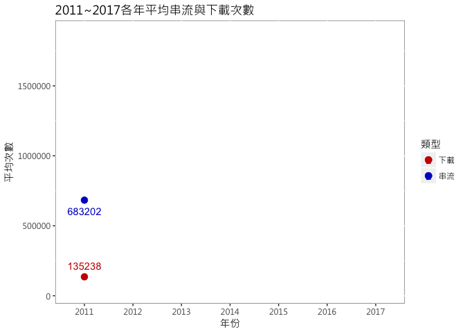

``` r
ggsave("A1-1.png", width = 20, height = 15, units = "cm")
#圖A1-2，2011年串流與下載趨勢，可看出2011年開始串流一直上升，下載先下降後持平停滯
ggplot() + 
    geom_line(data=MeanYearCount,aes(x = reorder(year,year),y = value,color=variable,group = variable),size=1)+
    geom_point(data=MeanYearCount[1,],aes(x = reorder(year,year),y = value,color=variable),color="#A9A9A9",size=3)+
    geom_text(data=MeanYearCount[1,],aes(x = reorder(year,year),y = value,color=variable,label = value),color="#FFFFFF",check_overlap = TRUE,vjust = -1, nudge_y = 0.5)+
    geom_point(data=MeanYearCount[8,],aes(x = reorder(year,year),y = value,color=variable),color="#A9A9A9",size=3)+
    geom_text(data=MeanYearCount[8,],aes(x = reorder(year,year),y = value,color=variable,label = value),color="#FFFFFF",check_overlap = TRUE,vjust = 2, nudge_y = 0.5)+
    geom_point(data=MeanYearCount[7,],aes(x = reorder(year,year),y = value,color=variable),color="#FFFFFF",size=3)+
    geom_text(data=MeanYearCount[7,],aes(x = reorder(year,year),y = value,color=variable,label = value),check_overlap = TRUE,vjust = -1, nudge_y = 0.5,color="#FFFFFF")+
    geom_point(data=MeanYearCount[14,],aes(x = reorder(year,year),y = value,color=variable), color="#FFFFFF",size=3)+
    ggtitle("2011~2017各年平均串流與下載次數")+
    labs(x="年份",y="平均次數")+
    scale_color_manual(name="類型",labels = c("下載", "串流"), values = c("#CC0000", "#0000CC")) +
    theme(panel.background = element_rect(fill = "white", colour = "grey50"),text = element_text(family = "Microsoft JhengHei"),legend.position="right")
```

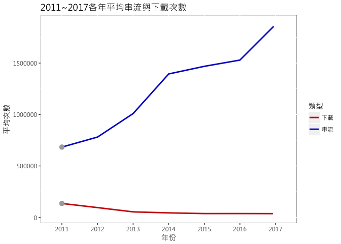

``` r
ggsave("A1-2.png", width = 20, height = 15, units = "cm")
#圖A1-3，2017年串流與下載資料點，可看出2017年串流比下載高出50倍之多
ggplot() + 
    geom_line(data=MeanYearDownloadCount,aes(x = reorder(year,year),y = value,group=variable),color="#A9A9A9",size=1)+
    geom_line(data=MeanYearStreamingCount,aes(x = reorder(year,year),y = value,group=variable),color="#A9A9A9",size=1)+
    geom_point(data=MeanYearCount[1,],aes(x = reorder(year,year),y = value,color=variable),color="#A9A9A9",size=3)+
    geom_text(data=MeanYearCount[1,],aes(x = reorder(year,year),y = value,color=variable,label = value),color="#A9A9A9",check_overlap = TRUE,vjust = -1, nudge_y = 0.5)+
    geom_point(data=MeanYearCount[8,],aes(x = reorder(year,year),y = value,color=variable),color="#A9A9A9",size=3)+
    geom_text(data=MeanYearCount[8,],aes(x = reorder(year,year),y = value,color=variable,label = value),color="#A9A9A9",check_overlap = TRUE,vjust = 2, nudge_y = 0.5)+
    geom_point(data=MeanYearCount[7,],aes(x = reorder(year,year),y = value,color=variable),size=3)+
    geom_text(data=MeanYearCount[7,],aes(x = reorder(year,year),y = value,color=variable,label = value),check_overlap = TRUE,vjust = -1, nudge_y = 0.5)+
    geom_point(data=MeanYearCount[14,],aes(x = reorder(year,year),y = value,color=variable),size=3)+
    geom_text(data=MeanYearCount[14,],aes(x = reorder(year,year),y = value,color=variable,label = value),check_overlap = TRUE,vjust = 2, nudge_y = 0.5)+
    ggtitle("2011~2017各年平均串流與下載次數")+
    labs(x="年份",y="平均次數")+
    scale_color_manual(name="類型",labels = c("下載", "串流"), values = c("#CC0000", "#0000CC")) +
    theme(panel.background = element_rect(fill = "white", colour = "grey50"),text = element_text(family = "Microsoft JhengHei"),legend.position="right")
```

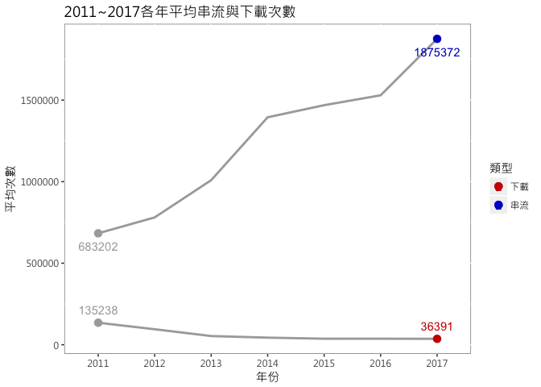

``` r
ggsave("A1-3.png", width = 20, height = 15, units = "cm")


#找出當年曾經top1歌曲
everRanking1<-filter(NewDigitalChart,year(SeventhDate)!="2017"&Ranking==1) %>%
  group_by(Song,Singer,Album) %>%
  summarise()
#掉出百名外相關資料
full1ToOut<-NULL
for(i in 1:dim(everRanking1)[1]){
  temp<-subset(NewDigitalChart,Song==everRanking1$Song[i]&Singer==everRanking1$Singer[i]) 
  full1ToOut<-rbind(full1ToOut,temp)
}
#由於還有歌曲為釣出百名外，所以改選至50名
fullR1ToR50<-filter(full1ToOut,Ranking<50) %>%
  group_by(Song,Singer,Album) %>%
  summarise(count=n(),firstOnChart=min(SeventhDate),year=as.integer(year(min(SeventhDate))))
#各年掉至50名外平均周數統計資料
R1ToR50Summary<-group_by(fullR1ToR50,year) %>%
  summarise(meanWeek=mean(count),nRank1Song=n())
#各年不重複的歌曲數統計資料
fullSong<-filter(NewDigitalChart,year(SeventhDate)!="2017") %>%
  group_by(Song,Singer,Album) %>%
  summarise(year=as.integer(year(min(SeventhDate))))
yearFullSong<-group_by(fullSong,year) %>%
  summarise(yearFullSong=n())
yearFullSong<-cbind(yearFullSong,R1ToR50Summary)
#圖A1-4，各年掉至50名外平均周數與當年歌曲數散布圖，由於每周榜單皆為100筆，可看出當年歌曲數與平均在榜週數有負相關
ggplot(data=yearFullSong,aes(x = yearFullSong,y =meanWeek))+ 
    geom_point()+
    ggtitle("各年歌曲數與Rank1出榜至Rank50外平均週數散布圖")+
    labs(x="歌曲數",y="平均週數")+
    geom_smooth(method='lm')+
    geom_text(aes(label = year),check_overlap = TRUE,vjust = 0, nudge_y = 0.5)+
    theme(panel.background = element_rect(fill = "white", colour = "grey50"),text = element_text(family = "Microsoft JhengHei"),legend.position="right")
```

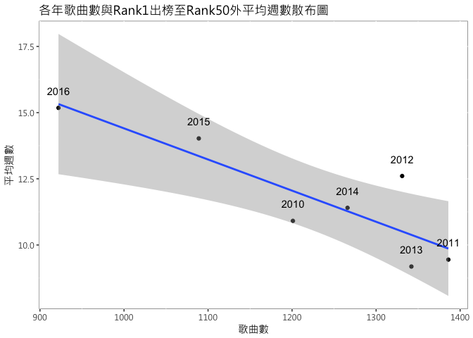

``` r
ggsave("A1-4.png", width = 20, height = 15, units = "cm")


#以播出時間分類韓劇，並過濾掉有停播的資料，再將其合併
NewKoreaDramaNoStop<-NewKoreaDrama[complete.cases(NewKoreaDrama),]
dramaBytime<-group_by(NewKoreaDramaNoStop,ChineseDramaName,KoreaDramaName,TV,Weekday)%>%
  summarise(value="Y")
dramaBytime<-dcast(dramaBytime, ChineseDramaName+KoreaDramaName+TV~Weekday)
typeBytime<-NULL
tempTypeBytime<-NULL
for(i in 1:dim(dramaBytime)[[1]]){
  if(is.na(dramaBytime[i,7])==T&
     is.na(dramaBytime[i,8])==T&
     is.na(dramaBytime[i,9])==T&
     is.na(dramaBytime[i,5])==T&
     is.na(dramaBytime[i,6])==T&
     is.na(dramaBytime[i,10])==F&
     is.na(dramaBytime[i,4])==F){
     tempTypeBytime="月火劇"
     typeBytime<-rbind(typeBytime,tempTypeBytime)
  }
  else if(is.na(dramaBytime[i,10])==T&
     is.na(dramaBytime[i,4])==T&
     is.na(dramaBytime[i,7])==F&
     is.na(dramaBytime[i,8])==F&
     is.na(dramaBytime[i,9])==T&
     is.na(dramaBytime[i,5])==T&
     is.na(dramaBytime[i,6])==T){
     tempTypeBytime="水木劇"
     typeBytime<-rbind(typeBytime,tempTypeBytime)
    }
  else if(is.na(dramaBytime[i,10])==T&
     is.na(dramaBytime[i,4])==T&
     is.na(dramaBytime[i,7])==T&
     is.na(dramaBytime[i,8])==T&
     is.na(dramaBytime[i,9])==F&
     is.na(dramaBytime[i,5])==F&
     is.na(dramaBytime[i,6])==T){
     tempTypeBytime="金土劇"
     typeBytime<-rbind(typeBytime,tempTypeBytime)
    }
  else if(is.na(dramaBytime[i,10])==T&
     is.na(dramaBytime[i,4])==T&
     is.na(dramaBytime[i,7])==T&
     is.na(dramaBytime[i,8])==T&
     is.na(dramaBytime[i,9])==T&
     is.na(dramaBytime[i,5])==F&
     is.na(dramaBytime[i,6])==F){
     tempTypeBytime="週末劇"
     typeBytime<-rbind(typeBytime,tempTypeBytime)
    }
  else if(is.na(dramaBytime[i,10])==F&
     is.na(dramaBytime[i,4])==F&
     is.na(dramaBytime[i,7])==F&
     is.na(dramaBytime[i,8])==F&
     is.na(dramaBytime[i,9])==F&
     is.na(dramaBytime[i,5])==T&
     is.na(dramaBytime[i,6])==T){
     tempTypeBytime="日日劇"
     typeBytime<-rbind(typeBytime,tempTypeBytime)
  }
  else{
     tempTypeBytime="other"
     typeBytime<-rbind(typeBytime,tempTypeBytime)
  }
}
dramaBytime<-cbind(dramaBytime,typeBytime)
NewKoreaDramaNoStop<-inner_join(NewKoreaDramaNoStop,dramaBytime,by=c("ChineseDramaName","KoreaDramaName","TV"))
NewKoreaDramaNoStop<-NewKoreaDramaNoStop[,c(1:7,15)]

#每部韓劇平均收視率
MeanRateByDrama<-group_by(NewKoreaDramaNoStop,ChineseDramaName,KoreaDramaName,TV,typeBytime) %>%
    summarise(meanRate=mean(Rate),TotalEP=n(),Date=min(Date))

#以韓劇類型區分各韓劇，大小為集數深淺為收視率
png(filename="A2-3.png",width=1824, height=1026)
treemap(MeanRateByDrama,
       index=c("typeBytime", "ChineseDramaName"),
       vSize="TotalEP", 
       vColor="meanRate", 
       type="value",
       title = "韓劇treemap(以播出時間區分、區塊大小：總集數、區塊深淺：平均收視率)",
       title.legend ="平均收視率",
       fontsize.title = 24,
       fontsize.labels=c(14),
       fontsize.legend = 14,
      fontfamily.title = "Microsoft JhengHei", 
      fontfamily.labels = "Microsoft JhengHei",
      fontfamily.legend = "Microsoft JhengHei")
dev.off()
```

    ## quartz_off_screen 
    ##                 2

``` r
#統計各種劇類型相關數據
dramaTotalEP<-group_by(NewKoreaDramaNoStop,ChineseDramaName,KoreaDramaName,typeBytime) %>%
  summarise(nEP=n(),meanRate=mean(Rate))
dramaTotalDramaByTypeTime<-group_by(dramaTotalEP,typeBytime) %>%
  summarise(nDrama=n(),meanEP=round(mean(nEP),1),sdEP=round(sd(nEP),1))
forColor<-NULL
for(i in 1:dim(dramaTotalDramaByTypeTime)[[1]]){
  if(dramaTotalDramaByTypeTime[i,3]>30)
  {
    tempForColor="Y"
    forColor<-rbind(forColor,tempForColor)
  }
  else{
    tempForColor="N"
    forColor<-rbind(forColor,tempForColor)
  }
}
dramaTotalDramaByTypeTime<-cbind(dramaTotalDramaByTypeTime,forColor)
#各類型韓劇平均集數
ggplot(data=dramaTotalDramaByTypeTime,aes(x = reorder(typeBytime,meanEP),y =meanEP,fill=forColor))+ 
    geom_bar(stat = "identity",color="black")+
    geom_text(aes(label=meanEP), vjust=0,hjust=-0.2)+
    coord_flip() +
    ggtitle("各類型韓劇平均集數")+
    labs(x="類型",y="平均集數")+
    scale_fill_manual(values = c('#A9A9A9', "#FFCC66")) +
    theme(panel.background = element_rect(fill = "white", colour = "grey50"),text = element_text(family = "Microsoft JhengHei"),legend.position="none")
```

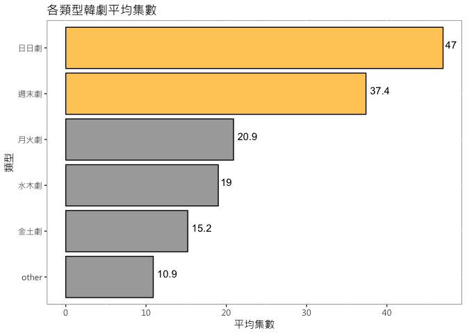

``` r
ggsave("A2-1.png", width = 20, height = 15, units = "cm")


#每個電視台每部韓劇平均收視率長條圖與誤差
MeanRateByDrama$TV<-as.factor(MeanRateByDrama$TV)
MeanRateByDrama.mean<-MeanRateByDrama%>%group_by(TV)%>%
    summarise(RateMean=mean(meanRate,na.rm = T),RateSD=sd(meanRate,na.rm = T))

#抓出第八集韓劇相關資料
KissEP8<-NULL
KissEP8<-filter(NewKoreaDramaNoStop,EP==8) %>%
  group_by(ChineseDramaName,KoreaDramaName,TV,Date,EP8Rate=Rate,Weekday,typeBytime) %>%
  summarise()
KissEP8<-inner_join(KissEP8,MeanRateByDrama,by=c("ChineseDramaName","KoreaDramaName","TV","typeBytime"))
KissEP8.m<-melt(KissEP8,id=c("ChineseDramaName","KoreaDramaName","TV","Weekday","typeBytime","TotalEP","Date.x","Date.y"))
EP8VSMean<-group_by(KissEP8.m,typeBytime,variable) %>%
  summarise(value=round(mean(value),1))
#各類型韓劇第八集收視率與平均收視長條圖
ggplot(data=EP8VSMean,aes(x = reorder(typeBytime,value),y =value,fill=variable))+ 
    geom_bar(stat = "identity",position='dodge',color="black")+
    geom_text(aes(label=value), vjust=0,hjust=0,position=position_dodge(.9))+
    coord_flip() +
    ggtitle("各類型韓劇第八集收視率與平均收視率之比較")+
    labs(x="類型",y="收視率")+
    scale_fill_manual(name="收視率",labels = c("EP8", "平均"),values = c("#FFCC66",'#A9A9A9')) +
    theme(panel.background = element_rect(fill = "white", colour = "grey50"),text = element_text(family = "Microsoft JhengHei"),legend.position="right")
```

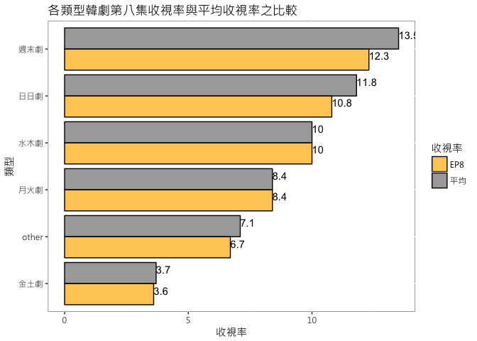

``` r
ggsave("A2-4.png", width = 20, height = 15, units = "cm")
#EP8韓劇與其平均差距heatmap
ggplot(KissEP8, aes(reorder(year(Date.y),year(Date.y)), reorder(typeBytime,EP8Rate))) + 
    geom_tile(aes(fill = (EP8Rate-meanRate)),colour = "white")+ 
    scale_fill_gradientn(colours=c("#A9A9A9","white", "#FF8800"), na.value = "white",limits = c(-5, 5) )+
    ggtitle("EP8韓劇與其平均差距heatmap")+
    labs(x="年份",y="類型")+
    theme(panel.background = element_rect(fill = "white", colour = "grey50"),text = element_text(family = "Microsoft JhengHei"),legend.position="right")+
    theme(legend.title=element_blank())
```

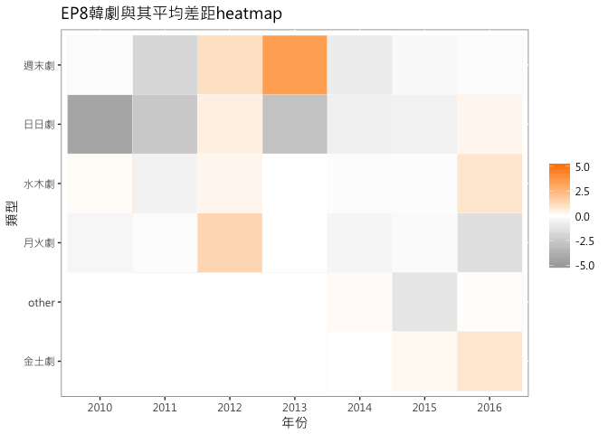

``` r
 ggsave("A2-6.png", width = 20, height = 15, units = "cm")


 
 
 
 
#
meanRateByTypeTime<-group_by(KissEP8,typeBytime) %>%
  summarise(meanRate=round(mean(meanRate),1))
forColor<-NULL
for(i in 1:dim(meanRateByTypeTime)[[1]]){
  if(meanRateByTypeTime[i,2]>11)
  {
    tempForColor="Y"
    forColor<-rbind(forColor,tempForColor)
  }
  else{
    tempForColor="N"
    forColor<-rbind(forColor,tempForColor)
  }
}
meanRateByTypeTime<-cbind(meanRateByTypeTime,forColor)
ggplot(data=meanRateByTypeTime,aes(x = reorder(typeBytime,meanRate),y =meanRate,fill=forColor))+ 
    geom_bar(stat = "identity",color="black")+
#    geom_errorbar(aes(x=typeBytime,ymin=meanEP-sdEP,
#            ymax=meanEP+sdEP), width=.1)+
    geom_text(aes(label=meanRate), vjust=-.05,hjust=0)+
    coord_flip() +
    ggtitle("各類型韓劇平均收視率")+
    labs(x="類型",y="平均收視率")+
    scale_fill_manual(values = c('#A9A9A9', "#FFCC66")) +
    theme(panel.background = element_rect(fill = "white", colour = "grey50"),text = element_text(family = "Microsoft JhengHei"),legend.position="none")
```

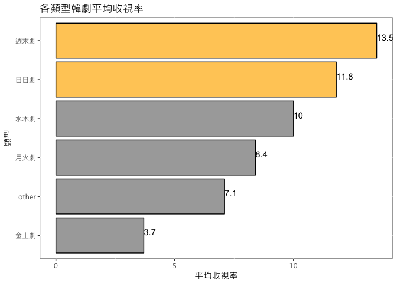

``` r
ggsave("A2-5.png", width = 20, height = 15, units = "cm")
#
dramaByTVTypeTime<-NULL
dramaByTVTypeTime<-group_by(MeanRateByDrama,TV,typeBytime) %>%
  summarise(nTypeTime=n(),meanRate=mean(meanRate),meanEP=mean(TotalEP))
dramaByTV<-group_by(dramaByTVTypeTime,TV) %>%
  summarise(sumnTypeTime=sum(nTypeTime))
dramaByTV<-dramaByTV[c(1:4,7:8,10),]
dramaByTVTypeTime<-inner_join(dramaByTVTypeTime,dramaByTV,by="TV")
typeTimeRate<-round(dramaByTVTypeTime$nTypeTime/dramaByTVTypeTime$sumnTypeTime,3)*100
typeTimeRate<-as.data.table(typeTimeRate)
dramaByTVTypeTime<-as.data.table(dramaByTVTypeTime)
dramaByTVTypeTime<-cbind(dramaByTVTypeTime,typeTimeRate)


#為了找出跟OST有關係的韓劇，先找書有OST字詞的歌曲，取出前面的劇名在與所擁有的歌曲合併，再過濾掉，剩下是韓劇OST的歌曲
OST<-NewDigitalChart[grepl("OST",NewDigitalChart$Album),]

OST1<-filter(OST,Ranking<50&year(SeventhDate)!="2017") %>%
  group_by(Song,Singer,Album) %>%
  summarise(count=n(),firstOnChart=min(SeventhDate),year=as.integer(year(min(SeventhDate))))

OST2<-group_by(OST1,year) %>%
  summarise(meanWeek=mean(count),nSong=n())
OSTDramaName<-NULL
for(i in 1:dim(OST1)[1]){
  temp<-strsplit(OST1$Album,"OST")[[i]][1]
  OSTDramaName<-rbind(OSTDramaName,temp)
}
dimnames(OSTDramaName)[[2]][1]<-"OSTDramaName"
OSTDramaName<-data.table(unique(OSTDramaName))


fullOSTDrama<-NULL
for(i in 1:dim(dramaTotalEP)[[1]]){
    temp<-NewDigitalChart[grepl(dramaTotalEP[i,2],NewDigitalChart$Album) ,]
    fullOSTDrama<-rbind(fullOSTDrama,temp)
}
fullOSTDrama1<-filter(fullOSTDrama,year(SeventhDate)!="2017") %>%
  group_by(Song,Singer,Album) %>%
  summarise(count=n(),firstOnChart=min(SeventhDate),lastOnChart=max(SeventhDate),year=as.integer(year(min(SeventhDate))))
#fullOSTDrama2<-group_by(fullOSTDrama1,year) %>%
#  summarise(meanWeek=mean(count),nSong=n())
OSTDramaName<-NULL
for(i in 1:dim(fullOSTDrama1)[1]){
  temp<-strsplit(fullOSTDrama1$Album,"OST|Part|_|-")[[i]][1]
  OSTDramaName<-rbind(OSTDramaName,temp)
}
fullOSTDrama1<-as.data.table(fullOSTDrama1)
OSTDramaName<-as.data.table(OSTDramaName)
fullOSTDrama1<-cbind(fullOSTDrama1,OSTDramaName)
dimnames(fullOSTDrama1)[[2]][8]<-"KoreaDramaName"
OSTData<-group_by(fullOSTDrama1,KoreaDramaName) %>%
  summarise(fullSongTotalWeek=sum(count),continuousWeek=max(count))
OSTData$KoreaDramaName<-str_trim(OSTData$KoreaDramaName)
OSTData<-inner_join(OSTData,dramaTotalEP,by="KoreaDramaName")
typeToTotalWeek<-group_by(OSTData,typeBytime) %>%
  summarise(sumWeek=sum(fullSongTotalWeek))
forColor<-NULL
for(i in 1:dim(typeToTotalWeek)[[1]]){
  if(typeToTotalWeek[i,2]>500)
  {
    tempForColor="Y"
    forColor<-rbind(forColor,tempForColor)
  }
  else{
    tempForColor="N"
    forColor<-rbind(forColor,tempForColor)
  }
}
typeToTotalWeek<-cbind(typeToTotalWeek,forColor)
#圖A3-1，各類型韓劇OST在gaon榜上總週數長條圖(含歌曲複數在榜的可能)
ggplot(data=typeToTotalWeek,aes(x=reorder(typeBytime,sumWeek),y=sumWeek,fill=forColor))+ 
    geom_bar(stat = "identity",color="black")+
    geom_text(aes(label=sumWeek), vjust=0,hjust = 0.05)+
    coord_flip() +
    ggtitle("各類型韓劇OST在gaon榜上總週數")+
    labs(x="類型",y="總週數")+
    scale_fill_manual(values = c('#A9A9A9', "#FFCC66")) +
    theme(panel.background = element_rect(fill = "white", colour = "grey50"),text = element_text(family = "Microsoft JhengHei"),legend.position="none")
```

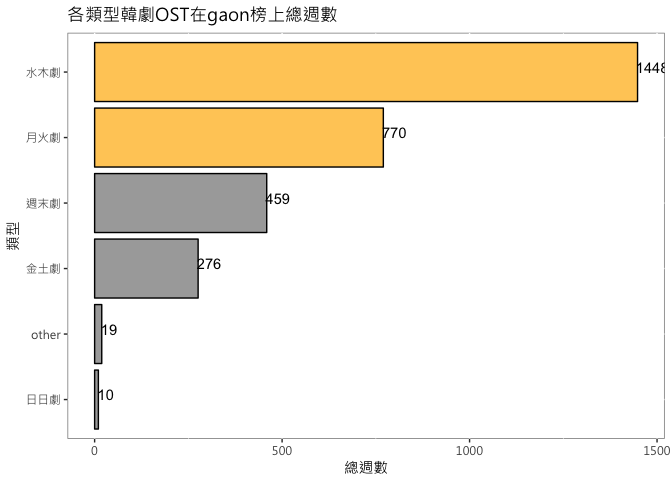

``` r
ggsave("A3-1.png", width = 20, height = 15, units = "cm")

#可看出水木劇與月火劇在綁數量較多，特別再篩選出來做調查
dramaMonToThu<-filter(OSTData,typeBytime=="水木劇"|typeBytime=="月火劇") %>%
  group_by(KoreaDramaName,ChineseDramaName,fullSongTotalWeek,continuousWeek,typeBytime,nEP,meanRate) %>%
  summarise()
#圖A3-2收視率與OST在榜週數散布圖(水木劇與月火劇)
ggplot(data=dramaMonToThu,aes(x = meanRate,y =continuousWeek,colour = typeBytime))+ 
    geom_point()+
    ggtitle("收視率與OST在榜週數散布圖(水木劇與月火劇)")+
    labs(x="平均收視率",y="在榜連續週數")+
    geom_smooth(method='lm',se=F)+
    scale_color_discrete(name="類型") +
    theme(panel.background = element_rect(fill = "white", colour = "grey50"),text = element_text(family = "Microsoft JhengHei"),legend.position="right")
```

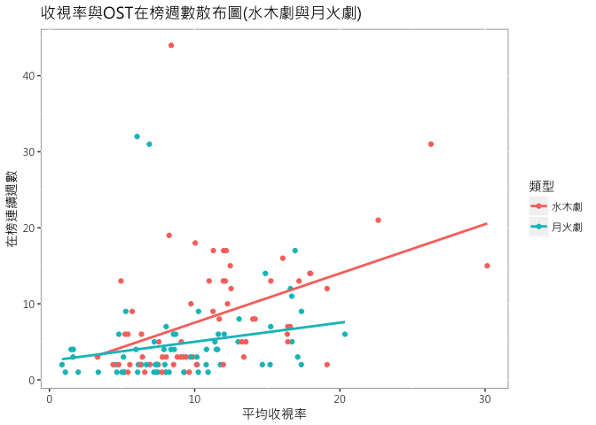

``` r
ggsave("A3-2.png", width = 20, height = 15, units = "cm")
#圖A3-3，收視率與OST在榜週數散布圖
ggplot(data=OSTData,aes(x = meanRate,y =continuousWeek,colour = typeBytime))+ 
    geom_point()+
    ggtitle("收視率與OST在榜週數散布圖")+
    labs(x="平均收視率",y="在榜連續週數")+
    geom_smooth(method='lm',se=F)+
    scale_color_discrete(name="類型") +
    theme(panel.background = element_rect(fill = "white", colour = "grey50"),text = element_text(family = "Microsoft JhengHei"),legend.position="right")
```

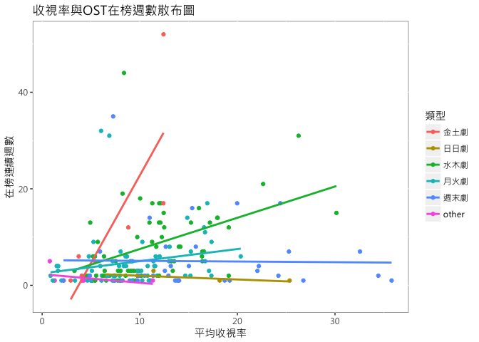

``` r
ggsave("A3-3.png", width = 20, height = 15, units = "cm")

#對斜率最高的金土劇做調查發現都是無線台的韓劇
dramaFriSat<-filter(MeanRateByDrama,typeBytime=="金土劇") %>%
  group_by(TV,meanRate,TotalEP,ChineseDramaName,KoreaDramaName,Date) %>%
  summarise()
dramaFriSatSummary<-group_by(dramaFriSat,TV)%>%
  summarise(nDrama=n())
forColor<-NULL
for(i in 1:dim(dramaFriSatSummary)[[1]]){
  if(dramaFriSatSummary[i,2]>10)
  {
    tempForColor="Y"
    forColor<-rbind(forColor,tempForColor)
  }
  else{
    tempForColor="N"
    forColor<-rbind(forColor,tempForColor)
  }
}
dramaFriSatSummary<-cbind(dramaFriSatSummary,forColor)
#圖A3-5，各電視台金土劇數目長條圖
ggplot(data=dramaFriSatSummary,aes(x=reorder(TV,nDrama),y=nDrama,fill=forColor))+ 
    geom_bar(stat = "identity",color="black")+
    geom_text(aes(label=nDrama), vjust=0,hjust = 0.05)+
    coord_flip() +
    ggtitle("各電視台金土劇數目")+
    labs(x="電視台",y="數目")+
    scale_fill_manual(values = c('#A9A9A9', "#FFCC66")) +
    theme(panel.background = element_rect(fill = "white", colour = "grey50"),text = element_text(family = "Microsoft JhengHei"),legend.position="none")
```

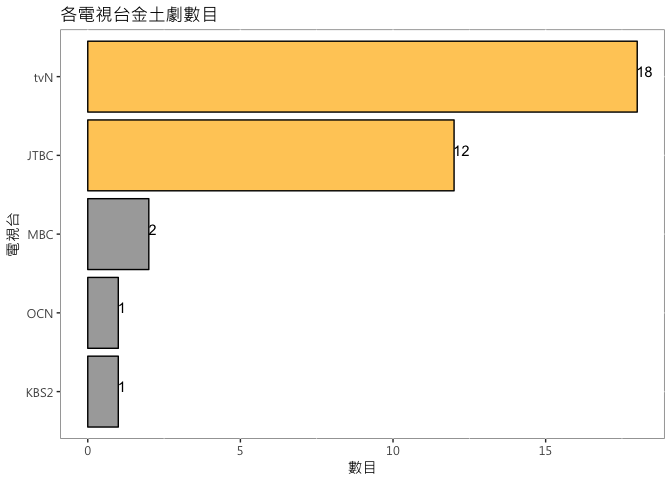

``` r
ggsave("A3-5.png", width = 20, height = 15, units = "cm")
#為了看出兩家無線電視台的收視率趨勢
dramaFriSat1<-dramaFriSat[c(1:12,17:34),]
#圖A3-6，tvN與JTBC日期與收視率散布圖，可看出主要是tvN在撐腰，且看出2017年初會是一個高峰
ggplot(data=dramaFriSat1,aes(x = Date,y =meanRate,colour = TV))+ 
    geom_point()+
    ggtitle("日期與收視率散布圖")+
    labs(x="日期",y="收視率")+
    geom_smooth(se=F)+
    scale_color_discrete(name="電視台") +
    theme(panel.background = element_rect(fill = "white", colour = "grey50"),text = element_text(family = "Microsoft JhengHei"),legend.position="right")
```

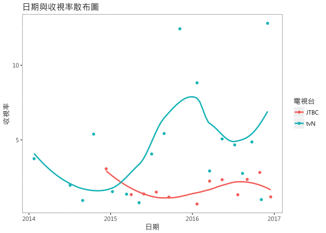

``` r
 ggsave("A3-6.png", width = 20, height = 15, units = "cm")
```

結論
----

1.平均在榜上時間久，可能表示音源很強，但也是榜外者競爭不足所致 2.驗證了第八集定律收視率並沒有比平均收視率高 3.日日劇、週末劇多為長輩觀賞，有集數較長、平均收視率較高之特性 4.水木劇、月火劇多為年輕族群觀賞，集數不長，但為OST銷出的大宗 5.金土劇多為無線台韓劇特有播放時段，在近期收視率也成長的趨勢
